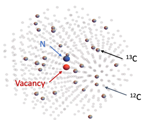

# Nuclear-spin-Hyperpolarization
This project contains the code and notes that I have used to study spin-fluctuator model. 
      

My notes:
1. Concentration of NV: 1ppm
2. Paramagnetic impurities P1: >20 ppm
3. Roles of P1 centers (in terms of charge ionization): they provides -ve electrons to NV center to make NV-charge state.
